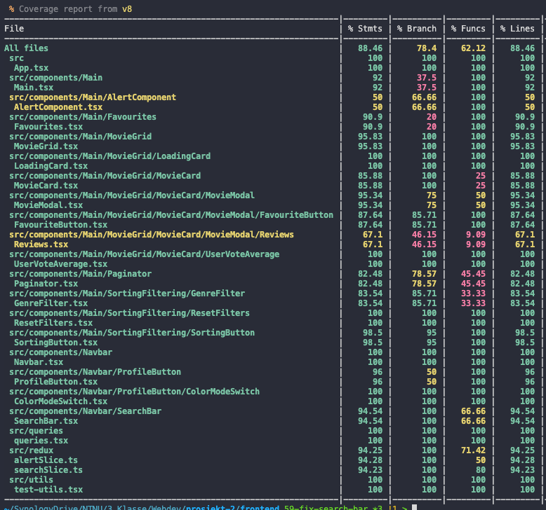

# Frontend

Frontend is built with Vite. This is a framework that uses React with TypeScript and comes with a variety of dependencies. The application primarily consists of a Navbar and a main section. The Navbar includes a logo, which links to the home page, a search field, and a profile button. The main section contains a grid displaying movies, along with buttons for sorting and filtering. The data is presented dynamically, with pagination to navigate between movie pages. Each page displays up to 20 movies. Movies can be sorted by title, popularity, and user score. It is also possible to search within the movie set, and the search functionality works in conjunction with filtering and sorting. Through the profile button, users can navigate to "My Favourites," a page where all the user's favorite movies are displayed similarly to the main page. Each movie can also be clicked to open a modal displaying more information about the movie, including actors and user-added movie reviews. Users can also add movies to favorites and add reviews here.

## Chakra UI

The user interface is created with the third-party framework Chakra UI. This framework provides pre-built React components. These components can be easily customized using inline CSS commands. This eliminates the need for CSS files while providing aesthetically pleasing and user-friendly components. It is also straightforward to implement dark/light mode using Chakra UI. We have implemented this, and users can switch according to their preference through the profile button.

## Structure

```
|-- frontend
|   |-- docs
|   |-- public
|   |   |-- logo.svg
|   |-- src
|   |   |-- __tests__
|   |   |   |-- App.test.tsx
|   |   |-- assets
|   |   |   |-- logo.png
|   |   |-- components
|   |   |   |-- Main
|   |   |   |   |-- Main.tsx
|   |   |   |   |-- __test__
|   |   |   |   |   |-- Main.test.tsx
|   |   |   |   |-- Favourites
|   |   |   |   |   |-- Favourites.tsx
|   |   |   |   |   |-- __tests__
|   |   |   |   |   |   |-- Favourites.test.tsx
|   |   |   |   |-- MovieGrid
|   |   |   |   |   |-- MovieGrid.tsx
|   |   |   |   |   |-- __tests__
|   |   |   |   |   |   |-- MovieGrid.test.tsx
|   |   |   |   |   |-- LoadingCard
|   |   |   |   |   |   |-- LoadingCard.tsx
|   |   |   |   |   |   |-- __tests__
|   |   |   |   |   |   |   |-- LoadingCard.test.tsx
|   |   |   |   |   |-- MovieCard
|   |   |   |   |   |   |-- MovieCard.tsx
|   |   |   |   |   |   |-- __tests__
|   |   |   |   |   |   |   |-- MovieCard.test.tsx
|   |   |   |   |   |   |-- MovieModal
|   |   |   |   |   |   |   |-- __tests__
|   |   |   |   |   |   |   |   |-- MovieModal.test.tsx
|   |   |   |   |   |   |   |-- FavouriteButton
|   |   |   |   |   |   |   |   |-- FavouriteButton.tsx
|   |   |   |   |   |   |   |   |-- __tests__
|   |   |   |   |   |   |   |   |   |-- FavouriteButton.test.tsx
|   |   |   |   |   |   |   |-- Reviews
|   |   |   |   |   |   |   |   |-- Reviews.tsx
|   |   |   |   |   |   |   |   |-- __tests__
|   |   |   |   |   |   |   |   |   |-- Reviews.test.tsx
|   |   |   |   |   |   |-- UserVoteAverage
|   |   |   |   |   |   |   |-- UserVoteAverage.tsx
|   |   |   |   |   |   |   |-- __tests__
|   |   |   |   |   |   |   |   |-- UserVoteAverage.test.tsx
|   |   |   |   |-- Paginator
|   |   |   |   |   |-- Paginator.tsx
|   |   |   |   |   |-- __tests__
|   |   |   |   |   |   |-- Paginator.test.tsx
|   |   |   |   |-- SortingFiltering
|   |   |   |   |   |-- GenreFilter
|   |   |   |   |   |   |-- GenreFilter.tsx
|   |   |   |   |   |   |-- __tests__
|   |   |   |   |   |   |   |-- GenreFilter.test.tsx
|   |   |   |   |   |-- ResetFilters
|   |   |   |   |   |   |-- ResetFilters.tsx
|   |   |   |   |   |   |-- __tests__
|   |   |   |   |   |   |   |-- ResetFilters.test.tsx
|   |   |   |   |   |-- SortingButton
|   |   |   |   |   |   |-- SortingButton.tsx
|   |   |   |   |   |   |-- __tests__
|   |   |   |   |   |   |   |-- SortingButton.test.tsx
|   |   |   |-- Navbar
|   |   |   |   |-- __tests__
|   |   |   |   |   |-- NavBar.test.tsx
|   |   |   |   |-- ProfileButton
|   |   |   |   |   |-- __tests__
|   |   |   |   |   |   |-- ProfileButton.test.tsx
|   |   |   |   |   |-- ColorModeSwitch
|   |   |   |   |   |   |-- ColorModeSwitch.tsx
|   |   |   |   |   |   |-- __tests__
|   |   |   |   |   |   |   |-- ColorModeSwitch.test.tsx
|   |   |   |   |-- SearchBar
|   |   |   |   |   |-- SearchBar.tsx
|   |   |   |   |   |-- __tests__
|   |   |   |   |   |   |-- SearchBar.test.tsx
|   |   |-- queries
|   |   |   |-- queries.tsx
|   |   |-- redux
|   |   |   |-- searchSlice.ts
|   |   |   |-- store.ts
|   |   |-- test
|   |   |   |-- setup.ts
|   |   |-- types
|   |   |   |-- reduxTypes.ts
|   |   |   |-- types.ts
|   |   |-- utils
|   |   |   |-- test-utils.tsx
|   |   |-- App.tsx
|   |   |-- index.tsx
|   |   |-- theme.ts
|   |   |-- vite-env.d.ts
|-- index.html
|-- package.json
|-- package-lock.json
|-- tsconfig.json
|-- tsconfig.node.json
|-- vite.config.ts
```

## Dependencies

- **@apollo/client:** Client library used with Apollo GraphQL, commonly used for handling GraphQL in React apps.
- **@chakra-ui/icons:** Icon components for Chakra UI, a popular React UI library.
- **@chakra-ui/react:** Chakra UI, a React UI library that provides simple and customizable components.
- **@emotion/react:** Emotion library for CSS in JavaScript.
- **@emotion/styled:** Emotion library for styled components in React.
- **@reduxjs/toolkit:** Toolkit for Redux, a state management library for React.
- **framer-motion:** Animation library for React.
- **graphql:** JavaScript implementation of GraphQL, used for sending GraphQL queries.
- **lodash:** Utility library to simplify data manipulation in JavaScript.
- **react:** Core library for React apps.
- **react-dom:** React DOM library for handling DOM-specific operations in React apps.
- **react-icons:** Library of icon components for React.
- **react-redux:** Redux bindings for React.
- **react-router-dom:** React library for handling navigation.
- **redux:** Library for centralized state management in JavaScript apps.
- **redux-persist:** Redux library for saving and restoring state across sessions.

### Development Dependencies

- **@testing-library/dom:** Testing tool for DOM manipulation.
- **@testing-library/jest-dom:** Jest addon for testing DOM elements.
- **@testing-library/react:** React testing tool for easier testing of React components.
- **@testing-library/user-event:** Testing tool for user interactions in the testing library.
- **@types/node:** TypeScript types for Node.js.
- **@types/react:** TypeScript types for React.
- **@types/react-dom:** TypeScript types for React DOM.
- **@types/react-test-renderer:** TypeScript types for React test renderer.
- **@typescript-eslint/eslint-plugin:** ESLint plugin for TypeScript.
- **@typescript-eslint/parser:** ESLint parser for TypeScript.
- **@vitejs/plugin-react:** Vite plugin for React integration.
- **@vitest/coverage-v8:** Test coverage for V8 engine.
- **eslint:** Tool for finding and fixing problems in JavaScript code.
- **eslint-plugin-react-hooks:** ESLint plugin for React hooks rules.
- **eslint-plugin-react-refresh:** ESLint plugin for React Refresh rules.
- **happy-dom:** Virtual DOM library for testing.
- **husky:** Git hooks library to run scripts on git actions.
- **jsdom:** JavaScript implementation of DOM for Node.js.
- **prettier:** Tool for code formatting.
- **pretty-quick:** Tool to run Prettier on changed files in git.
- **react-test-renderer:** React test tool to render components to a format that can be tested.
- **typescript:** TypeScript language.
- **vite:** Vite, a fast build tool for modern web development.
- **vitest:** Test library for Vite.

## Testing

### Component Testing

Component tests are written with Vitest and @testing-library. All components are tested to some degree, totaling 46 tests spread across 17 files. Test files are located in folders named **tests** at the same location as the files they test. To run all tests, the command `npm run test` is used. These tests achieve a test coverage of 88.46%. To check the coverage, the command `npm run coverage` is used. (Note: Both of these commands must be run in "frontend").



### End-to-End

Automatic end-to-end testing with Playwright has also been added. This can be run with the command `npx playwright test`, or `npx playwright test --ui` for a visual representation of the tests. (Note: These commands must be run in frontend). These tests are located in the **e2e** folder. It is also possible to run the command `npx playwright show-report` to get a report on the tests. There are 11 tests created to test the main functionality of the application.
